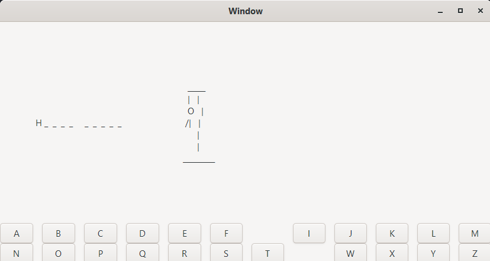
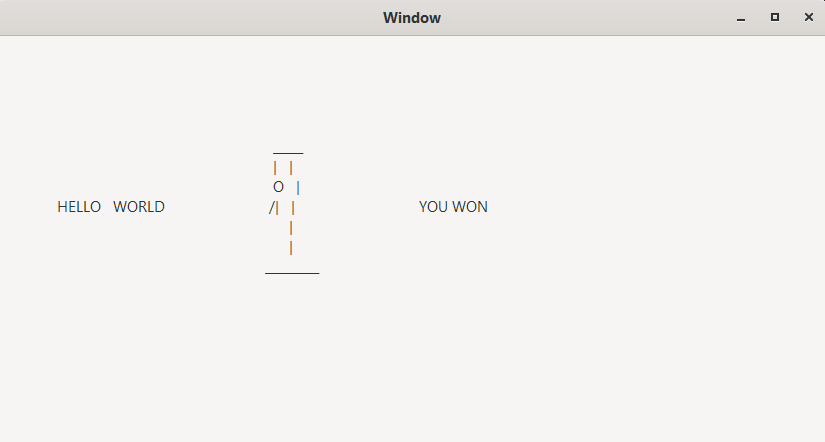

# hangman.jl
A two-player hangman game written in Julia

## Dependencies
```
using Pkg
Pkg.install("Gtk")
```

## How to play
The first window will appear, prompting a player to enter a word to be guessed
Delete the prompt text and when your word is typed, click the "Enter" button


A new window will then appear with buttons representing letters, a blank space where 
the word that was entered goes, and a gallows. Buttons can be clicked in order to make guesses.

Buttons will disappear once they are clicked. 



If the player fails to guess the whole word before the man is complete, they lose.


If the player's guesses reveal the entire word, they have won.



The answer is always shown after every game. 
